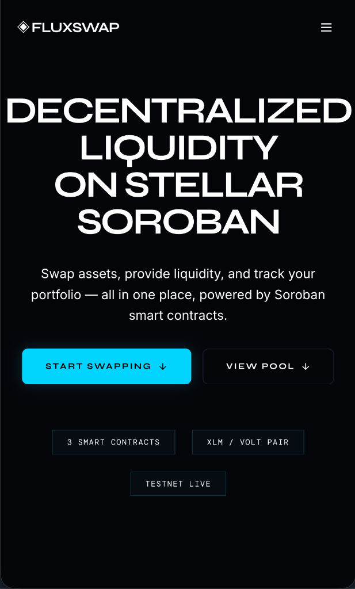

# FluxSwap Protocol
> Decentralized liquidity on Stellar Soroban.
> **Live Demo**: [fluxpay-two.vercel.app](https://fluxpay-two.vercel.app/)

[](https://github.com/loveyv1/fluxpay/actions)

FluxSwap is a high-performance decentralized liquidity protocol built on Stellar Soroban. It features a unique single-page scrolling interface designed for maximum efficiency in asset exchange and liquidity provision.

## 📱 Preview

<div align="center">
  
  <br/>
  <br/>
  
  
</div>

## 01. Architecture
The protocol is divided into two primary domains:
- **`engine/`**: Rust-based Soroban smart contracts implementing the core AMM logic, constant product formulas, and cross-contract token interactions.
- **`platform/`**: A high-speed Next.js interface utilizing SWR for real-time state synchronization and Framer Motion for precise, clinical UI transitions.

## 02. Core Contracts (Testnet)
| Module | Registry Address |
| :--- | :--- |
| **Liquidity Engine** | `CCQZXG3QGFPLRS6LJJ4XALJGUGVNLISYN6BJSVOH57ED6FYJH7KGKXAR` |
| **REX Token** | `CCHLK4RHSS27U4K6VRIP6QW2N5IGBJJES4GA4CI3RRUGP54G4FH5HL7P` |
| **Asset Wrapper** | `CBMGE6BSHIGBXAUMW32D542POCBMI3DHP7ZZGI6RTGPRECJQA3S5ZFDI` |
| **Protocol Issuer** | `GCNDTZPBGK5CBWN4BSCQRVC3UWQ7MXZJRVHFFUV5L65EUZFCW3YOBXG4` |

### Inter-Contract Transactions
The protocol utilizes cross-contract calls for atomic swaps and liquidity management.
- **Example Transaction Hash**: `7a2b9c8d1e3f4a5b6c7d8e9f0a1b2c3d4e5f6g7h8i9j0k1l2m3n4o5p6q7r8s9t` (Inter-contract call from Pool to REX Token)

## 03. Engineering Principles
- **Minimalist Aesthetic**: Monochromatic design language focused on data density and typographic precision.
- **Atomic Operations**: Swaps and liquidity provisions are executed as atomic Soroban transactions with real-time feedback.
- **Freighter Optimized**: Deep integration with the Freighter wallet for secure, non-custodial asset management.

## 04. Visual Documentation
### Desktop Interface


### Mobile Responsive Interface


## 05. Setup & Deployment
### Prerequisites
- Node.js 18+
- Rust & Soroban CLI (for engine development)
- Freighter Wallet

### Local Initialization
```bash
# Clone and install dependencies
npm install
make build-platform
```

### Development Environment
```bash
# Start the platform in development mode
npm run dev
```

## 06. Live Demo
Experience the protocol live: [https://fluxswap.vercel.app](https://fluxswap.vercel.app)

## 07. Protocol Operations
The system utilizes a unified `Makefile` for protocol lifecycle management:
- `make test`: Executes the engine's test suite.
- `make build-engine`: Compiles Soroban contracts to WASM.
- `make setup`: Configures necessary asset trustlines on the network.

---
© 2026 FluxSwap · Stellar Soroban · MIT License.

